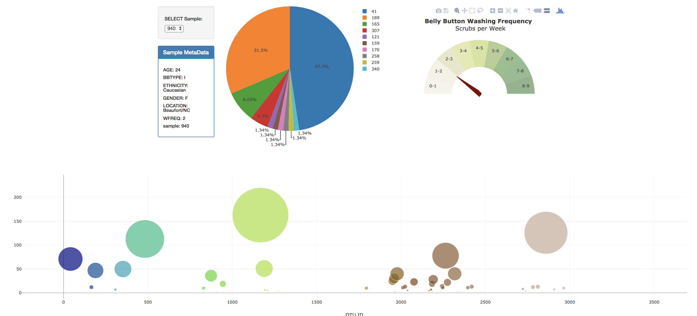

# Belly Button Biodiversity

## Step 1 - Flask API

Used Flask to design an API for your dataset and to serve the HTML and JavaScript required for your dashboard page

* First, create a template called `index.html` for your dashboard landing page. Use the Bootstrap grid system to create the structure of the dashboard page.

* Next, created the following routes for my api.

```python
@app.route("/")
    """Return the dashboard homepage."""
```

```python
@app.route('/names')
    """List of sample names.

    Returns a list of sample names in the format
    [
        "BB_940",
        "BB_941",
        "BB_943",
        "BB_944",
        "BB_945",
        "BB_946",
        "BB_947",
        ...
    ]

    """
```

```python
@app.route('/otu')
    """List of OTU descriptions.

    Returns a list of OTU descriptions in the following format

    [
        "Archaea;Euryarchaeota;Halobacteria;Halobacteriales;Halobacteriaceae;Halococcus",
        "Archaea;Euryarchaeota;Halobacteria;Halobacteriales;Halobacteriaceae;Halococcus",
        "Bacteria",
        "Bacteria",
        "Bacteria",
        ...
    ]
    """
```

```python
@app.route('/metadata/<sample>')
    """MetaData for a given sample.

    Args: Sample in the format: `BB_940`

    Returns a json dictionary of sample metadata in the format

    {
        AGE: 24,
        BBTYPE: "I",
        ETHNICITY: "Caucasian",
        GENDER: "F",
        LOCATION: "Beaufort/NC",
        SAMPLEID: 940
    }
    """
```

```python
@app.route('/wfreq/<sample>')
    """Weekly Washing Frequency as a number.

    Args: Sample in the format: `BB_940`

    Returns an integer value for the weekly washing frequency `WFREQ`
    """
```

```python
@app.route('/samples/<sample>')
    """OTU IDs and Sample Values for a given sample.

    Sort your Pandas DataFrame (OTU ID and Sample Value)
    in Descending Order by Sample Value

    Return a list of dictionaries containing sorted lists  for `otu_ids`
    and `sample_values`

    [
        {
            otu_ids: [
                1166,
                2858,
                481,
                ...
            ],
            sample_values: [
                163,
                126,
                113,
                ...
            ]
        }
    ]
    """
```

- - -

## Step 2 - Plotly.js

Use Plotly.js to build interactive charts for your dashboard.

* Used the route `/names` to populate a dropdown select element with the list of sample names.

* Created a Bubble Chart that uses data from your routes `/samples/<sample>` and `/otu` to plot the **Sample Value** vs the **OTU ID** for the selected sample.

* Displayed the sample metadata from the route `/metadata/<sample>`

## Result

